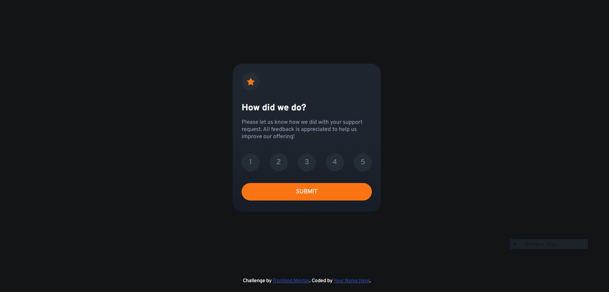

# Frontend Mentor - Interactive rating component solution

This is a solution to the [Interactive rating component challenge on Frontend Mentor](https://www.frontendmentor.io/challenges/interactive-rating-component-koxpeBUmI). Frontend Mentor challenges help you improve your coding skills by building realistic projects. 

## Table of contents

- [Overview](#overview)
  - [The challenge](#the-challenge)
  - [Screenshot](#screenshot)
  - [Links](#links)
- [My process](#my-process)
  - [Built with](#built-with)
  - [What I learned](#what-i-learned)
- [Author](#author)

## Overview

The channel was to try and recreated this interactive element: 

### The challenge

Users should be able to:

- View the optimal layout for the app depending on their device's screen size
- See hover states for all interactive elements on the page
- Select and submit a number rating
- See the "Thank you" card state after submitting a rating

### Screenshot

Here is my solution: 

### Links

- Solution URL: [Solution link](https://www.frontendmentor.io/solutions/interactive-rating-component-desktop-pYimSeRXUJ)
- Live Site URL: [Live site](https://tombirbeck.github.io/interactive-rating-component/)

## My process

#### Inital

I began by setting the document to a box sizing of border box.
I then created the card element for the star rating, making a html shell, adding the information and then styling as close to the original as I could.
After this I created a main.js file and imported it into the html file using a script tag at the bottom of the body element. I used this file to capture the html elements and added eventlisteners so that I could track the mouse enter and leaving the option and submit button elements. I declared a stars variable to that I could capture the value when an element was selected.
I then created the thank you card, to which I attached the hidden class. I created a function to handle the submit that would add the class hidden to the rating card and remove it from the thankyou card when the submit button was clicked.

#### Refactored

After receiving some feedback on my initial I went back and changed the rating system to a form with radio buttons and tried to match the styling to the original.

### Built with

- Semantic HTML5 markup
- CSS custom properties
- Flexbox
- JavaScript

### What I learned

It was good to remind myself about the mouse enter and leave events and how to create a hover effect using them.
After feedback I was able to learn more about how forms are set up and using the hover effect with pure CSS. By doing this I was able to reduce the amout of JavaScript required by a significant amount.

## Author

- Website - [Tom Birbeck](https://portfolio-tombirbeck.vercel.app/)
- Github - [Thomasb](https://github.com/TomBirbeck)
- Frontend Mentor - [Tom Birbeck](https://www.frontendmentor.io/profile/TomBirbeck)
